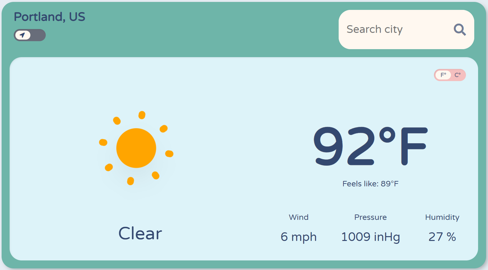
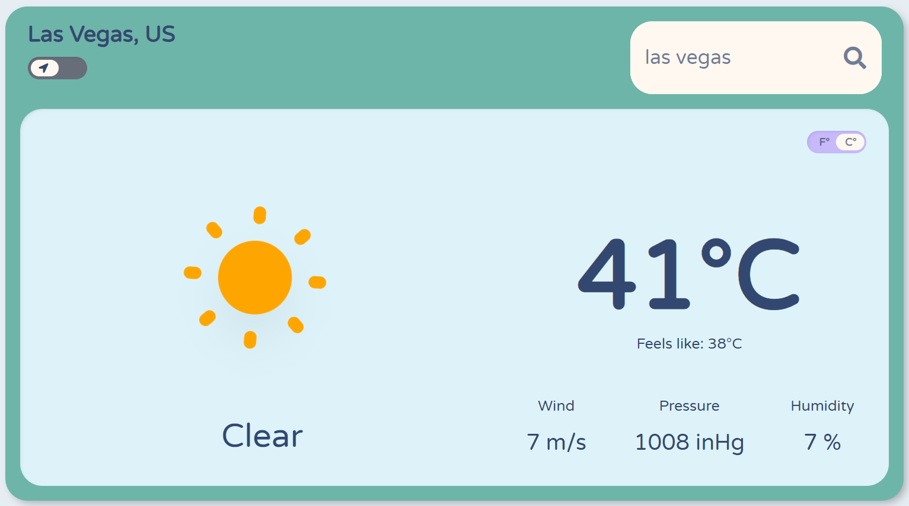
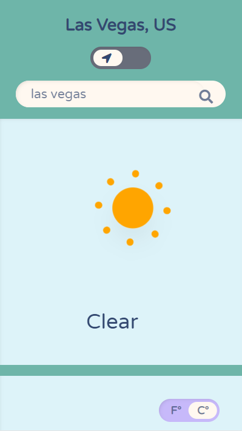

<h1 align="center">Weather Dashboard</h1>
<h2 align="center"><a  href="https://chloe-trn.github.io/weather-dashboard/"  target="_blank">Live Demo</a></h2>

 A responsive weather application created using OpenWeatherMap API. The default city is Chicago. 

## Table of Contents

- [Table of contents](#table-of-contents)
- [Tools Used](#tools-used)
- [Features](#features)
  - [User Location Toggle](#user-location-toggle)
  - [Units Toggle](#units-toggle)
  - [Weather Search By City](#weather-search-by-city)
  - [Integrated Animations](#integrated-animations)
  - [Responsiveness](#responsiveness)
- [Future Work](#future-work)

## Tools Used

 

* This website is created with jQuery, CSS, and HTML. 
* This website is deployed on GitHub Pages.

## Features 
### User Location Toggle 

* Application uses the <a href="https://developer.mozilla.org/en-US/docs/Web/API/Geolocation_API" target="_blank">Geolocation Web API</a> to fetch the user's coordinates and fetch the weather from <a href="https://openweathermap.org/" target="_blank">OpenWeatherMap API</a> using those coordinates. 
### Units Toggle

 

* For the current location, the weather details can be toggled between imperial (farenheit) and metric (celsius) units. Each toggle calls the OpenWeatherMap API again to get the information in the units desired. 
### Weather Search By City 

* Inputting a city will display the resulting current weather information for that city on the dashboard.
* An invalid search will result in a browser alert popping up. 

### Integrated Animations

 

* Animations are mapped for all weather descriptions provided by OpenWeatherMap API. The full range of weather animations are provided from <a href="https://www.amcharts.com/free-animated-svg-weather-icons/" target="_blank">amCharts SVG weather animations.</a> The mist animation is custom made with CSS keyframes animation. 

### Responsiveness

* The layout of the dashboard transitions to column format at the 770px breakpoint. This is done through the use of CSS flex-direction propertiy in a media query. Font sizes also scale down accordingly. 

## Future Work 
* Implement 7 day forecast 

